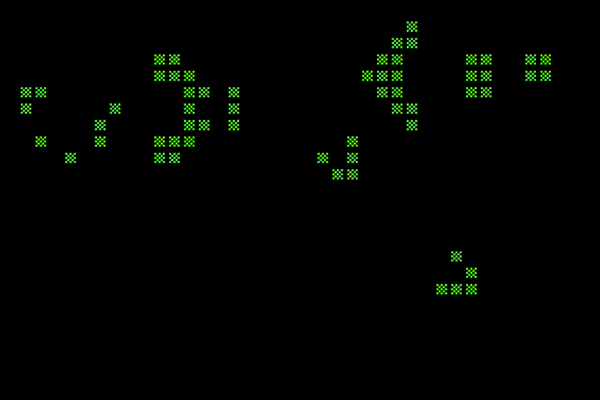

# Conway's Game of Life for Apple II
Written in 6502 assembly and not documented very well.



## Building the Project
### Give the Makefile a Spin
Who knows? Maybe you're super nerdy and have all the prerequisites to run the `makefile`.

Type:
```sh
git clone https://github.com/thelbane/ConwayII.git
cd ConwayII
make run
```
(If this worked for you on the first try, you're officially a bigger loser than me.)

### Makefile Requirements
Here's the list of the prerequisites you'll need to get the `makefile` to work.

* [DASM](https://sourceforge.net/projects/dasm-dillon/files/dasm-dillon/) (2.20.11) - Macro assembler.
  * Make sure this is saved somewhere in your PATH.
* [AppleCommander](https://sourceforge.net/projects/applecommander/files/AppleCommander%20-%20Stable/) (1.3.5) - Apple II disk image utility.
  * Requires Java (because this will be neither easy nor straightforward)
  * Save the .jar file to `/usr/local/bin/ac.jar` or modify the path in the `makefile` using a text editor
* [Virtual \]\[](http://www.virtualii.com/) (7.6) - Apple II emulator.
  * Requires Apple II ROMs (because emulation)

Once you've tried and failed to satisfy all of these requirements (because you realized too late that Virtual ][ is a Mac emulator and you're on Windows), just launch your favorite Apple II emulator and open `diskimages/conway.dsk`.

### I Just Want to Assemble the Darn Thing
If you have DASM installed, you should be able to `make all` or assemble the project with:

```sh
dasm src/conway.asm -oconway -v4 -f2
```

As if by magic, you'll see the following file has been created:
```sh
-rw-r--r--   1 thelbane  staff   814B May  6 11:45 conway
```

Now type `./conway` and watch your so-called "modern" PC utterly fail to comprehend what to do with this 814 byte program. This is where a disk image utility (like AppleCommander) comes in handy.

## It Doesn't Really Seem That Fast
So you installed Java (twice) and found three different //e ROMs that are all slightly different, but all sort of work... and got it up and running... or you chose to just stare at the animated gif above and get all of the reward without any of the effort. And you're thinking, "He calls this 'pretty fast?' I've implemented Game of Life in Javascript, which is like today's version of BASIC, and it ran about a gajillion times faster than this."

Well, I stand by my claim that it's pretty fast... for an Apple II running at 1MHz.

### Optimizations
I'll admit the source is not organized particularly well and the comments are rather uninspired, but if you're comfortable with 6502 assembly, it shouldn't be too difficult to follow.

Still, here's a list of the optimizations I've made. (Probably not exhaustive.)
* Padded data
  * The matrix of visible cells is surrounded by an invisible layer of hidden cells. e.g., There are 40x24 visible cells, but the array containing information about the cells is 42x26.
  * This removes the need for bounds checking when evaluating neighboring cells in the innermost loop, resulting in a significant speedup.
  * This is a pretty common optimization since it's easy to reason about and implement.
* Lookup table for rules
  * Each cell can have between 0 and 8 neighbors.
  * The neighbor count is used as an index to a lookup table that dictates whether a cell is turned on, turned off, or unchanged.
* Draw and update in the same loop
  * While there's only one visible screen of data, the Conway rules must be applied atomically (all at once), necessitating two pages worth of cell data (one representing the current generation [mainData], and another representing the next generation [altData]).
  * The pointers for mainData and altData swap before each full screen draw cycle.
  * Starting from the bottom right-most cell we work our way left and up the screen, one row at a time.
  * For each cell:
    * Use the byte in mainData to lookup the rule in the rules table and display a character.
    * If the cell is ON, increment the neighbor count for all surrounding cells (in altData). If the cell is OFF, we don't have to do anything with our neighbors, resulting in substantially fewer cycles spent on empty cells.
* Lookup table for screen addresses
  * The Apple II is weird in that text and graphics data is not stored from left to right, top to bottom, in a contiguous chunk of memory. It's stored all haphazard and non-sensical for reasons that others have pontificated on at length.
  * Needless to say, there's math to compute the addresses of a given point on the screen, but math is slow and lookup tables are silly fast.
  
I didn't do much with loop unrolling, but there are certainly opportunities to be gained there along with other optimizations. There's some housekeeping that has to be done between screen updates due to the way I'm clearing stale data during the main update loops.

Anyway, I hope this was at least mildly interesting to you. Cheers. :)
